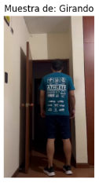
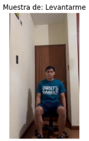
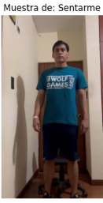
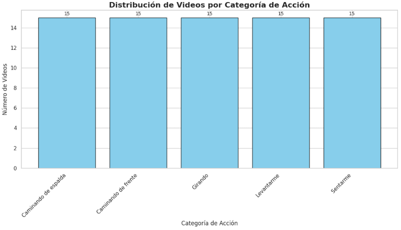

# Fase 2: Comprensión de los Datos (Data Understanding)

## 1. Análisis Exploratorio de Datos

### 1.1. Descripción del Dataset

Para el desarrollo de este proyecto, se ha seleccionado un conjunto de datos público disponible en la plataforma Kaggle, diseñado específicamente para tareas de reconocimiento de actividades humanas.

**Dataset:** [Human Activity Recognition (HAR) Video Dataset](https://www.kaggle.com/datasets/sharjeelmazhar/human-activity-recognition-video-dataset)

Este conjunto de datos consta de una colección de videoclips cortos que capturan a diversas personas realizando un conjunto de actividades predefinidas. Los videos están organizados en carpetas, donde cada carpeta corresponde a una categoría de acción, facilitando así el proceso de etiquetado. Las acciones incluidas en el dataset son:

*   clapping
*   meeting and splitting
*   sitting
*   standing still
*   walking
*   walking while reading book
*   walking while using the phone

La elección de este dataset se fundamenta en su directa aplicabilidad a los objetivos del proyecto, ya que incluye acciones fundamentales como `sitting`, `standing still`, `walking`, `clapping` y `meet and split`, que son la base para el sistema de reconocimiento que se busca construir, además se grabaron videos para suplir las actividades que faltan.

### 1.2. Configuración del Entorno e Importación de Librerías

Se importaron las librerías necesarias para el análisis, incluyendo `os` para la interacción con el sistema operativo, `cv2` (OpenCV) para el procesamiento de video, `numpy` y `pandas` para la manipulación de datos, `matplotlib` para la visualización y `google.colab` para montar Google Drive y acceder a los datos.

```python
# Importar librerías
import os
import cv2
import numpy as np
import matplotlib.pyplot as plt
from google.colab import drive
import pandas as pd

# Montar Google Drive
drive.mount('/content/drive')
```

### 1.3. Exploración Inicial del Dataset

Se definió la ruta del dataset y se listaron las categorías de acciones encontradas en las carpetas:

- Caminando de frente
- Caminando de espalda
- Girando
- Levantarme
- Sentarme

Posteriormente, se extrajeron y mostraron las propiedades de un video de muestra por cada categoría. Esto nos da una idea inicial de las características técnicas de los videos, como la resolución, los fotogramas por segundo (FPS) y la duración.

**Propiedades de los videos (uno por categoría):**

| | Categoría | Video | Resolución | FPS | Frames | Duración (s) |
| :--- | :--- | :--- | :--- | :--- | :--- | :--- |
| 0 | Caminando de frente | Caminando.mp4 | 480x848 | 30.05 | 113 | 3.76 |
| 1 | Caminando de espalda | Espalda 3.mp4 | 480x848 | 30.07 | 102 | 3.39 |
| 2 | Girando | Girando.mp4 | 464x832 | 60.12 | 260 | 4.33 |
| 3 | Levantarme | Levantarme.mp4 | 464x832 | 60.15 | 161 | 2.68 |
| 4 | Sentarme | Sentado.mp4 | 464x832 | 60.00 | 210 | 3.50 |

### 1.4. Visualización de Muestras

Para tener una mejor comprensión visual de los datos, se mostró el primer fotograma de un video de cada categoría de acción.

**Muestras de video por categoría:**

| Muestra de: Caminando de frente | Muestra de: Caminando de espalda | Muestra de: Girando | Muestra de: Levantarme | Muestra de: Sentarme |
| :--- | :--- | :--- | :--- | :--- |
|  |  |  |  |  |

### 1.5. Procesamiento con MediaPipe y Extracción de Puntos Clave (Landmarks)

Se utilizó la librería `mediapipe` para detectar y extraer los puntos clave del cuerpo (pose landmarks) de las personas en los videos. Estos puntos clave son coordenadas que representan las articulaciones y partes importantes del cuerpo, y serán las características que utilizaremos para entrenar nuestro modelo de reconocimiento de actividades.


Se realizó una prueba con un video de la categoría "Caminando de frente" para visualizar los landmarks detectados.

**Análisis de video con MediaPipe:**


Posteriormente, se procesaron todos los videos del dataset para extraer los landmarks de cada fotograma y se guardaron en archivos CSV para su posterior uso.

**Archivos generados (ejemplos):**
- [Caminando de frente_Caminando2.csv](https://drive.google.com/file/d/1GvmannANPlv0pXwIMV1tmUgmAX8YXNKy/view?usp=sharing)
- [Caminando de espalda_Espalda 3.csv](https://drive.google.com/file/d/1bXW115AzAJj8HfL0cWOApib8Jv8u_XsX/view?usp=sharing)
- [Girando_Girando.csv](https://drive.google.com/file/d/1N2gq-N5_MHDrNrT5OjFuood5ROdJ9kFS/view?usp=sharing)

## 2. Análisis Cuantitativo

Se realizó un análisis numérico para entender la composición y distribución del dataset.

**Objetivo:** Entender la distribución y el balance de las clases. Un desbalance podría sesgar el entrenamiento del modelo.

**Categorías de acciones encontradas:**
`['Caminando de espalda', 'Caminando de frente', 'Girando', 'Levantarme', 'Sentarme']`

**Conteo de videos por cada categoría (propios):**

| | Numero de Videos |
| :--- | :--- |
| Caminando de espalda | 15 |
| Caminando de frente | 15 |
| Girando | 15 |
| Levantarme | 15 |
| Sentarme | 15 |

**Gráfico de distribución:**



Como se puede observar en la tabla y el gráfico, el dataset está perfectamente balanceado, con 15 videos para cada una de las 5 categorías de acciones. Esto es ideal para el entrenamiento de un modelo de clasificación, ya que evita que el modelo se incline a favor de las clases con más ejemplos.

## 3. Estrategia de Obtención de Datos Adicionales

### 3.1. Justificación

El análisis ha confirmado la calidad y el balance del dataset público. Sin embargo, para mejorar la robustez y la capacidad de generalización del modelo, es fundamental ampliar el conjunto de datos.

Una observación clave es que los videos del dataset público fueron grabados en condiciones de iluminación y disposición general que no son altamente especializadas. Esto presenta una oportunidad significativa, ya que **nos permite replicar y expandir el dataset de manera consistente con nuestros propios recursos**.

Al **nutrir la base de datos con nuestros propios videos**, buscamos:
*   **Aumentar el volumen de datos:** Un mayor número de ejemplos ayuda al modelo a aprender patrones más complejos y a mejorar su precisión.
*   **Introducir mayor variabilidad:** La captura de datos propios nos permite introducir deliberadamente variaciones en los sujetos (diferentes personas, complexiones, ropa), entornos (interiores, exteriores), condiciones de iluminación y ángulos de cámara.
*   **Reducir el sesgo del dataset (dataset bias):** Un modelo entrenado únicamente con los datos originales podría no generalizar bien a nuevos entornos o personas. Nuestros datos ayudarán a que el modelo sea más robusto ante estas variaciones.

### 3.2. Plan de Acción

Para llevar a cabo la recolección de datos, se seguirá el siguiente plan:

1.  **Definición de Clases:** Se grabarán videos para las mismas cinco categorías existentes: "Caminando de frente", "Caminando de espalda", "Girando", "Levantarme" y "Sentarme".
2.  **Protocolo de Grabación:**
    *   **Diversidad de Sujetos:** Participarán múltiples individuos para capturar diferencias en la forma de moverse.
    *   **Variedad de Entornos:** Se utilizarán diferentes fondos y locaciones para evitar que el modelo aprenda a asociar una acción con un fondo específico.
    *   **Condiciones de Iluminación:** Se capturarán videos bajo distintas condiciones de luz (natural, artificial) para mejorar la robustez del modelo.
3.  **Especificaciones Técnicas:** Para mantener la consistencia, los videos se grabarán con una resolución y tasa de fotogramas (FPS) similares a las del dataset original.
4.  **Organización y Etiquetado:** Los nuevos videos se organizarán en la misma estructura de carpetas por categoría para facilitar su integración y procesamiento junto con el dataset original.

## 4. Implementación Técnica y Código Fuente

Todo el proceso de análisis exploratorio, desde la carga de datos hasta la visualización y extracción de características con MediaPipe, se encuentra documentado y ejecutado en un notebook de Google Colab. Este documento sirve como una referencia técnica detallada y permite la reproducibilidad de los resultados presentados en este informe.

Para consultar el código, los pasos detallados y los resultados completos, acceda al siguiente enlace:

- [**Ver el Notebook de Análisis Exploratorio en Google Colab**](https://github.com/elkofix/human-activity-posture-analysis/blob/d7f7a4dd517ed76f7330e82a2d1dd68b881a6921/entrega1/notebooks/Analisis_exploratorio_de_datos_Entrega1.ipynb)