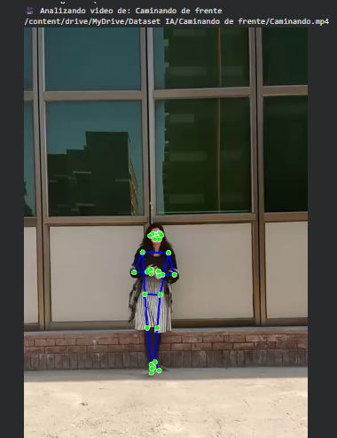

### **Fase 3: Preparación de los Datos**

#### **1. Introducción a la Preparación de Datos**

En esta fase, el objetivo es transformar los datos de video en crudo, que consisten en una colección de archivos `.mp4`, en un conjunto de datos estructurado y significativo, listo para ser utilizado en el entrenamiento de modelos de aprendizaje automático. El proceso se divide en tres pasos clave:

1.  **Extracción de Puntos Clave (Landmarks):** Utilizando la librería MediaPipe de Google para identificar la pose humana en cada fotograma.
2.  **Consolidación de Datos:** Unificar los datos de todos los videos en un único conjunto de datos.
3.  **Ingeniería de Características:** Calcular nuevas variables (ángulos entre articulaciones) que son más robustas y representativas de los movimientos que las coordenadas en bruto.

#### **2. Paso 1: Extracción de Puntos Clave con MediaPipe**

Para representar numéricamente el movimiento humano, se utilizó la solución **MediaPipe Pose**. Esta herramienta analiza cada fotograma del video y detecta la ubicación de 33 puntos clave o *landmarks* del cuerpo humano (hombros, codos, rodillas, etc.), proporcionando sus coordenadas (x, y, z) en el espacio.

El proceso se automatizó mediante un script que:
1.  Recorre cada video del dataset.
2.  Lee el video fotograma por fotograma.
3.  Aplica el detector de pose de MediaPipe a cada fotograma.
4.  Si se detecta una persona, se extraen las coordenadas (x, y, z) de los 33 landmarks.
5.  Los datos de cada video se guardan en un archivo CSV individual, donde cada fila corresponde a un fotograma y cada columna a una coordenada de un landmark.

A continuación, se muestra un ejemplo visual de los landmarks detectados por MediaPipe en un fotograma del video "Caminando de frente".



#### **3. Paso 2: Consolidación y Análisis Cuantitativo**

Una vez que cada video fue procesado y convertido a un archivo CSV, el siguiente paso fue consolidar toda esta información en un único DataFrame de Pandas. Este proceso implicó:

1.  Leer cada uno de los 75 archivos CSV generados.
2.  Añadir una columna llamada `action` a cada conjunto de datos para etiquetar cada fotograma con la acción correspondiente (ej. "Caminando de frente", "Sentarme").
3.  Combinar todos los DataFrames en uno solo.

El DataFrame final resultante contiene **3332 filas** (fotogramas totales) y **100 columnas** (99 para las coordenadas de los landmarks y 1 para la etiqueta de la acción).

Un análisis inicial de la distribución de los fotogramas por clase reveló el siguiente desbalance:

```
action
Caminando de frente     1602
Caminando de espalda     612
Girando                  475
Sentarme                 347
Levantarme               296
Name: count, dtype: int64
```

Como se puede observar, la clase "Caminando de frente" tiene una representación significativamente mayor que las demás. Este desbalance es un factor crítico a tener en cuenta durante la fase de modelado, ya que podría hacer que el modelo se incline a predecir la clase mayoritaria con más frecuencia.

#### **4. Paso 3: Ingeniería de Características a partir de Ángulos**

Las coordenadas en bruto de los landmarks son muy sensibles a la posición de la persona en el encuadre y a la distancia de la cámara. Para crear características más robustas e invariantes a la escala y la posición, se calcularon los ángulos entre las principales articulaciones del cuerpo.

Se definió una función `calculate_angle` que, dados tres puntos (por ejemplo, hombro, codo y muñeca), calcula el ángulo en el punto central (el codo). Se calcularon los siguientes 8 ángulos para cada fotograma:

*   Ángulo del codo izquierdo y derecho.
*   Ángulo del hombro izquierdo y derecho.
*   Ángulo de la cadera izquierda y derecha.
*   Ángulo de la rodilla izquierda y derecha.

Este proceso transformó nuestro dataset de 99 coordenadas por fotograma a un dataset de **8 características angulares**, mucho más compacto y significativo.

**DataFrame de Características Final:**

| angle_left_elbow | angle_right_elbow | angle_left_shoulder | angle_right_shoulder | angle_left_hip | angle_right_hip | angle_left_knee | angle_right_knee |
| :--- | :--- | :--- | :--- | :--- | :--- | :--- | :--- |
| 143.14 | 139.23 | 100.32 | 104.39 | 106.31 | 115.32 | 67.87 | 84.44 |
| 146.83 | 142.03 | 87.58 | 94.13 | 130.14 | 133.79 | 83.75 | 93.31 |
| ... | ... | ... | ... | ... | ... | ... | ... |

Este nuevo DataFrame `features_df` junto con las etiquetas `y` es el que se utilizará en la fase de modelado.