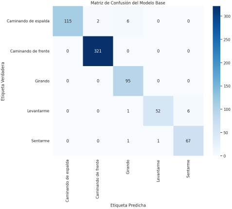
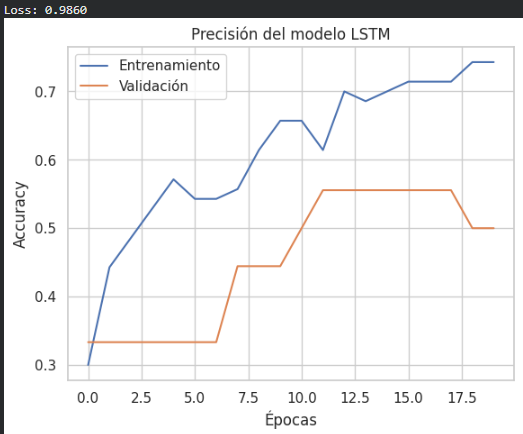

### **Fase 4: Modelado**

#### **1. Introducción al Modelado**

El objetivo de esta fase es entrenar y evaluar diferentes modelos de clasificación para predecir la acción humana basándose en las características de ángulos extraídas en la fase anterior. Se explorarán tres modelos distintos y se realizará un ajuste de hiperparámetros para optimizar el rendimiento del mejor candidato.

#### **2. Paso 1: División del Conjunto de Datos**

Antes de entrenar cualquier modelo, es fundamental dividir los datos en un conjunto de **entrenamiento** y un conjunto de **prueba**.

*   **Conjunto de Entrenamiento (80%):** Utilizado para que el modelo aprenda los patrones de cada acción.
*   **Conjunto de Prueba (20%):** Reservado para evaluar el rendimiento del modelo con datos que no ha visto previamente.

Se utilizó la función `train_test_split` de Scikit-learn, con el parámetro `stratify=y` para asegurar que la proporción de cada clase fuera la misma tanto en el conjunto de entrenamiento como en el de prueba, lo cual es crucial dado el desbalance de clases identificado.

*   **Tamaño del conjunto de entrenamiento:** 2665 muestras.
*   **Tamaño del conjunto de prueba:** 667 muestras.

#### **3. Paso 2: Modelo Base - Random Forest Classifier**

Se seleccionó un **Random Forest Classifier** como modelo base por su robustez y buen rendimiento general sin necesidad de un ajuste complejo.

**Resultados del Modelo Base:**

El modelo alcanzó una **precisión general (accuracy) del 97%** en el conjunto de prueba. El reporte de clasificación detallado es el siguiente:

```
                      precision    recall  f1-score   support

Caminando de espalda       1.00      0.93      0.97       123
 Caminando de frente       0.99      1.00      1.00       321
             Girando       0.92      1.00      0.96        95
          Levantarme       0.98      0.88      0.93        59
            Sentarme       0.92      0.97      0.94        69

            accuracy                           0.97       667
           macro avg       0.96      0.96      0.96       667
        weighted avg       0.98      0.97      0.97       667
```

**Análisis:**
*   El modelo es extremadamente bueno identificando "Caminando de frente" y "Girando".
*   El punto más débil es el *recall* de la clase "Levantarme" (88%), lo que indica que el modelo confundió un 12% de las instancias de "Levantarme" con otras acciones.



#### **4. Paso 3: Ajuste de Hiperparámetros con GridSearchCV**

Para intentar mejorar el rendimiento del Random Forest, se utilizó `GridSearchCV` para encontrar la mejor combinación de hiperparámetros. Se probaron 81 combinaciones diferentes de:
*   `n_estimators`:
*   `max_depth`: [10, 20, None]
*   `min_samples_leaf`:
*   `min_samples_split`:

La mejor combinación encontrada fue:
`{'max_depth': 20, 'min_samples_leaf': 1, 'min_samples_split': 5, 'n_estimators': 200}`

**Resultados del Modelo Optimizado:**

El modelo optimizado obtuvo una **precisión general del 97%**, idéntica al modelo base. Las métricas por clase mostraron una ligera variación, con una pequeña disminución en el *f1-score* para "Girando" y "Levantarme", pero manteniendo un rendimiento global muy alto.

**Conclusión del Ajuste:** El modelo base ya era muy robusto. El ajuste de hiperparámetros no aportó una mejora significativa, lo que sugiere que el modelo ya estaba cerca de su máximo rendimiento con las características de ángulos proporcionadas.

#### **5. Paso 4: Comparación con Otros Modelos**

Para validar la elección del Random Forest, se entrenaron otros dos modelos con los mismos datos:

1.  **Support Vector Machine (SVM):**
    *   **Accuracy:** 90%
    *   **Análisis:** Aunque es un buen resultado, es inferior al del Random Forest. Tuvo dificultades particulares con "Levantarme" (f1-score de 51%) y "Sentarme" (f1-score de 74%).

2.  **Red Neuronal Recurrente (LSTM):**
    *   **Accuracy:** 69.57%
    *   **Análisis:** Este modelo, que está diseñado para secuencias, tuvo el rendimiento más bajo. Esto puede deberse a que los datos se agruparon en secuencias de 30 fotogramas, lo que resultó en muy pocas muestras de entrenamiento (solo 88). Las LSTMs generalmente requieren conjuntos de datos mucho más grandes para aprender patrones temporales complejos.



#### **6. Conclusión y Selección del Modelo Final**

El **Random Forest Classifier (modelo optimizado)** fue el claro ganador, con una precisión del 97% y un rendimiento muy equilibrado en todas las clases. Por su alto desempeño y eficiencia, este es el modelo seleccionado para el despliegue.

Para facilitar su uso futuro, el modelo entrenado se guardó en el archivo `pose_classification_model.joblib` utilizando la librería `joblib`.

---

### **Análisis Inicial de Impactos y Plan de Despliegue**

#### **1. Análisis de Impactos de la Solución**

**a) Impacto Positivo:**
*   **Seguridad y Salud:** En entornos industriales o de cuidado de personas mayores, el sistema podría detectar posturas anómalas o caídas (aunque no entrenado para ello, es una extensión posible), alertando para una intervención rápida.
*   **Ergonomía y Productividad:** Podría analizar los movimientos de trabajadores en una línea de montaje para identificar posturas ineficientes o de riesgo ergonómico, ayudando a optimizar los procesos y prevenir lesiones.
*   **Rehabilitación y Deporte:** Podría ser usado para monitorear la correcta ejecución de ejercicios de fisioterapia o técnicas deportivas, proporcionando feedback al usuario.

**b) Riesgos y Mitigación:**
*   **Privacidad:** El uso de cámaras para monitorear personas es intrusivo.
    *   **Mitigación:** La solución procesa los datos en tiempo real y solo extrae coordenadas de esqueleto (landmarks), sin almacenar imágenes o videos de las personas, anonimizando la información. Se debe comunicar de forma transparente el propósito del monitoreo.
*   **Sesgo del Modelo:** El modelo fue entrenado con un conjunto de datos limitado. Podría no funcionar igual de bien con personas de diferentes contexturas físicas, etnias, o si usan ropa muy holgada que oculte las articulaciones.
    *   **Mitigación:** Para un producto comercial, sería necesario re-entrenar el modelo con un dataset mucho más diverso y representativo de la población objetivo.
*   **Aceptación Social:** Los empleados o personas monitoreadas podrían sentirse vigilados y rechazar la tecnología.
    *   **Mitigación:** Enfatizar que el objetivo es la seguridad y la mejora de procesos, no el control. Involucrar a los usuarios finales en el diseño y la implementación.

**c) Consideraciones Éticas:**
*   **Consentimiento:** Es imperativo obtener el consentimiento informado de todas las personas que serán monitoreadas por el sistema.
*   **Uso de los Datos:** Se debe garantizar que los datos generados (predicciones de actividad) no se utilicen para fines punitivos o discriminatorios, como evaluar el rendimiento de un empleado de manera injusta.
*   **Transparencia:** El funcionamiento del sistema y el uso que se le dará a la información deben ser claros para todos los involucrados.

#### **2. Plan de Despliegue (Borrador Inicial)**

El despliegue de la solución se puede plantear en un sistema modular para demostración:

**a) Componentes:**
1.  **Módulo de Captura y Procesamiento:**
    *   **Tecnología:** Una aplicación en Python utilizando OpenCV para capturar el video de una cámara web en tiempo real.
    *   **Función:** En cada fotograma, utilizará MediaPipe para extraer los landmarks de la pose y luego calculará los 8 ángulos característicos, tal como se hizo en la preparación de datos.

2.  **Módulo de Inferencia (Backend):**
    *   **Tecnología:** Un microservicio ligero usando un framework como Flask o FastAPI en Python.
    *   **Función:** Este servicio cargará el modelo `pose_classification_model.joblib` guardado. Expondrá un endpoint (una URL) que recibirá los 8 ángulos calculados y devolverá la predicción de la acción en formato JSON (ej. `{"action": "Sentarme"}`).

3.  **Módulo de Visualización (Frontend):**
    *   **Tecnología:** La misma aplicación de OpenCV del módulo de captura.
    *   **Función:** Después de enviar los ángulos al backend y recibir la respuesta, mostrará en pantalla el video de la cámara web con los landmarks superpuestos y un texto en una esquina con la acción predicha en tiempo real.

**b) Flujo de Trabajo en Tiempo Real:**

1.  La cámara captura un fotograma.
2.  MediaPipe procesa el fotograma y extrae los 33 landmarks.
3.  El script calcula los 8 ángulos clave.
4.  Estos 8 ángulos se envían al servicio de inferencia (backend).
5.  El modelo cargado en el backend predice la acción.
6.  El resultado se devuelve al módulo de visualización.
7.  La acción predicha se muestra en la pantalla junto al video.
8.  El ciclo se repite para el siguiente fotograma.

Este plan permite un despliegue de prueba funcional y demuestra la capacidad del modelo para operar en un entorno simulado en tiempo real.